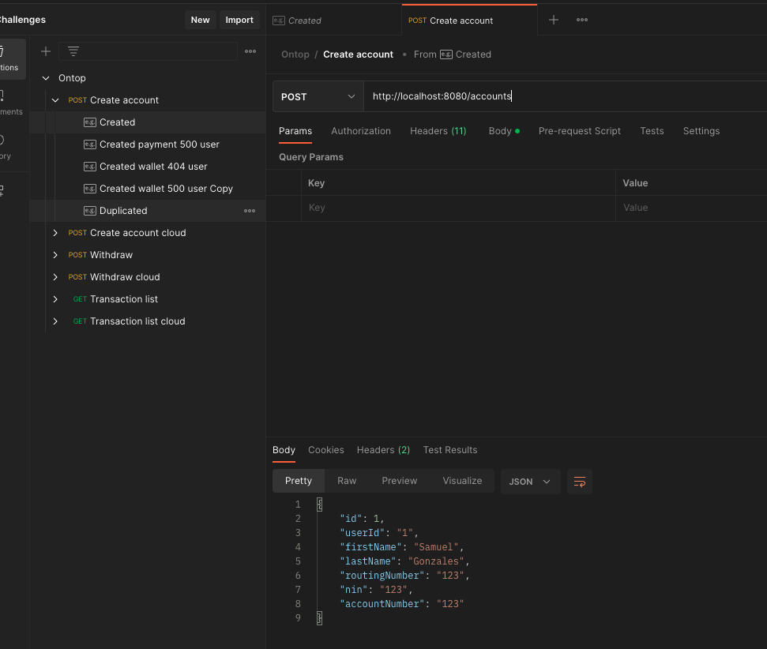

# This is my solution from the challenge from [Ontop](https://www.getontop.com/) 💪

### Table of content

- [Project description](#description)

- [Features](#features)

- [Todo](#todo)

- [Technologies & Tools](#-technologies--tools)

- [Run on local](#run-on-local)

- [Test evidences](#test-evidences)

- [Authors](#authors)

---------------------------------------------------------------------------------------------------------------------------------------------------------------------------------

## Description

A Rest API to serve the functionality of transfers from Ontop Account to customer Account. The API is developed over Spring Boot using Hexagonal Architecture. 

As show in this diagram this app have one input the Rest API Client generating one adapter for.

For the business logic use case are generated and the domain to define the business logic and domain objects.

For integration with the output ports is using repositories to connect to H2 database and service to connect to the
external services.

## Features

✅ `Feature 1:` Create customer Account.

✅ `Feature 2:` Withdraw

✅ `Feature 3:` Transaction list

## Todo

☑️ `Feature 1:` Create more than one Account for userId

☑️ `Feature 2:` Top up

☑️ `Feature 3:` Improvement of the list api

☑️ `Feature 3:` Add docker support

---------------------------------------------------------------------------------------------------------------------------------------------------------------------------------

## 🛠 Technologies & Tools

- **Language:** Java 17
- **Framework :** Spring Boot 3
- **Architecture :** Hexagonal architecture
- **Web framework :** Webflux
- **Data framework :** Spring Data R2DBC
- **Database :** H2
- **Api Docs :** Spring Doc

---------------------------------------------------------------------------------------------------------------------------------------------------------------------------------

## Run on local

1. Clone the repo
2. Install java 17 (SDK Man or from another install manager)
3. inside the repo on the console run the ./mvnw test for run the unit test of the project (macos / linux) / mvnw.cmd
   test (windows)
4. Inside the repo on the console run ./mvnw spring-boot:run to start the app / mvnw.cmd spring-boot:run (windows). The
   project runs on the default port 8080.
5. Use the postman collection to test [Postman collection](readme-files/Ontop.postman_collection.json) inside this collection there are the 3 generated endpoints one with the localhost URL and another with a cloud vendor url.
6. To test first you must create the Account with the account endpoint (there is a examples in postman) and after that use the witdraw endpoint to generate the operations (there are examples in postman). Additional there is a list endpoint to review the saved data by user.
7. Also can enter to the swagger-ui [Swagger UI](http://localhost:8080/swagger-doc/webjars/swagger-ui/index.html)

## Test evidences

-------------------------------------------------------------------------------------------------------------------------------------------------------------------------

## Authors

| [ Samuel Gonzales](https://github.com/samusfree) |  
|:---------------------------------------------------------------------------------------------------------------------------------------:|
